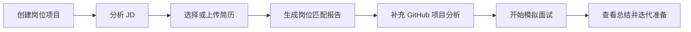

# OwlMock

<p align="center">
  <strong>把岗位理解、项目复盘、简历匹配与模拟面试连接成一套完整的 AI 求职准备工作流。</strong>
</p>

<p align="center">
  <a href="https://owlmock-production.up.railway.app/">在线体验</a>
  ·
  <a href="#使用-docker-启动">本地部署</a>
  ·
  <a href="#railway-部署">Railway 部署</a>
  ·
  <a href="#数据与安全">数据与安全</a>
</p>

<p align="center">
  
  
  
  
  <a href="LICENSE"></a>
</p>


OwlMock 是一个可部署、支持多用户使用的 AI 求职准备 Web App。访客可以直接浏览产品首页；创建岗位项目、上传简历、运行分析或开始面试时，需要使用邮箱注册并登录。每位用户的项目、简历、分析任务和面试记录相互隔离。

当前版本支持 JD、简历、GitHub 项目与模拟面试之间的上下文联动，并提供异步任务恢复、模型 fallback、持久化存储、健康检查与备份恢复能力，适合在 Railway 或自有 Docker 环境中运行。

## 核心能力

| 模块 | 能力 | 输出 |
| --- | --- | --- |
| 岗位项目 | 将目标岗位、JD、简历和面试记录组织在同一工作区 | 岗位准备进度、下一步建议、完整历史 |
| JD 分析 | 粘贴 JD 文本，或上传 PNG/JPEG 岗位截图 | 硬性要求、优先条件、技能权重、隐含期待、风险点、面试重点 |
| 简历中心 | 管理 PDF/PNG/JPG 简历，并与一个或多个目标岗位匹配 | 匹配分数、差距分析、优化建议、岗位横向对比 |
| GitHub 分析 | 分析公开 GitHub 仓库的结构、代码与工程实践 | 项目概览、深度报告、亮点提炼、项目追问题 |
| 模拟面试 | 技术、行为和综合面试，支持文字与实时语音模式 | 流式问答、过程记录、面试总结与改进建议 |
| 任务与历史 | 后台执行长任务，并在页面切换或刷新后恢复 | 任务进度、失败重试、历史查看与删除 |
| 可观测性 | 可选接入 Langfuse 与 OpenTelemetry | Agent、工具、模型调用、延迟、错误和 token 记录 |

## 账户与访问方式

OwlMock 面向公开用户，而不是单一管理员工具。

- 访客无需登录即可浏览首页和产品能力。
- 点击“开始使用”或进入具体工作流时，会要求注册或登录。
- 注册使用普通邮箱地址与密码，不依赖短信，也不需要付费验证码服务。
- 密码使用标准库 `scrypt` 加盐哈希，登录状态存储在签名的 HttpOnly Cookie 中。
- 项目、简历、分析、任务和面试会话均按用户 ID 隔离。
- 当前 beta 暂不提供邮箱验证与密码找回；可通过配置关闭公开注册。

## 产品工作流



### GitHub 仓库分析

```text
GitHub URL
  -> Repository Loader (shallow clone / archive / API snapshot)
  -> Repository Cache + Repository Index
  -> Repo Analyzer Agent
  -> Overview / Deep Report / Interview Questions
  -> SQLite + Task Progress / SSE
```

同一仓库会复用缓存和 `repo_index.json`，减少重复下载与无意义的工具调用。仓库工作区位于后端源码目录之外，避免开发模式下因下载代码触发服务重启。

### JD 与简历匹配

```text
JD Text/Image -> Asynchronous JD Analysis -> Structured JD Report
Resume PDF/Image + One or More JD Reports
  -> Multimodal Resume Parsing
  -> Independent Match Tasks
  -> Score Comparison + Detailed Reports
```

### 模拟面试

```text
Text:  Message -> ReAct Agent -> SSE Events
Voice: Interviewer Question -> Audio Chunks -> Commit Answer
       -> Realtime Model -> Next Question -> Summary
```

语音模式采用明确的分轮控制。用户点击“回答完毕”后才进入下一题，避免环境噪音或短暂停顿导致回答被意外截断。

## 界面预览

<details open>
<summary><strong>文字模拟面试</strong></summary>


</details>

<details>
<summary><strong>语音模拟面试</strong></summary>

<p align="center">
  
</p>

</details>

<details>
<summary><strong>GitHub 仓库概览</strong></summary>


</details>

<details>
<summary><strong>GitHub 深度分析</strong></summary>


</details>

<details>
<summary><strong>JD 分析报告</strong></summary>


</details>

<details>
<summary><strong>Langfuse Trace</strong></summary>

<p align="center">
  
</p>

</details>

## 技术架构

| 层级 | 技术 |
| --- | --- |
| 前端 | Vue 3、Vite 6、Vue Router、Tailwind CSS、Lucide Icons |
| 后端 | Python 3.13、FastAPI、SQLAlchemy 2.0、aiosqlite |
| Agent | ReAct Agent Loop、Realtime Voice Agent、YAML Agent Profile、Tool System |
| 模型接入 | DashScope Qwen、Zhipu GLM、OpenAI-compatible Adapter |
| 实时通信 | SSE、WebSocket、DashScope Qwen-Omni Realtime、PCM16 |
| 数据 | SQLite、JSONL Session Events、Markdown Memory、Repository Cache |
| 可观测性 | Langfuse、OpenTelemetry |
| 部署 | Docker、Docker Compose、Railway |

生产镜像采用多阶段构建：先构建 Vue 静态资源，再将前端产物与 FastAPI 服务打包进同一个运行镜像。前端、`/api` 与 `/ws` 使用同一域名，不需要单独部署前端服务。

## 模型路由

默认模型由 `backend/config/agents/*.yaml` 管理，也可以使用环境变量按场景覆盖。

| 场景 | 主模型 | 备用模型 |
| --- | --- | --- |
| 简历分析 | `dashscope/qwen3.5-omni-plus` | `zhipu/glm-4.6v-flash` |
| 简历与岗位匹配 | `dashscope/qwen3.5-omni-plus` | `zhipu/glm-4.6v-flash` |
| JD 分析 | `dashscope/qwen3.5-omni-plus-2026-03-15` | `zhipu/glm-4.6v-flash` |
| GitHub 分析 | `dashscope/qwen3.5-omni-plus-2026-03-15` | `zhipu/glm-4.6v-flash` |
| 模拟面试与总结 | `dashscope/qwen3.5-omni-plus-2026-03-15` | `zhipu/glm-4.6v-flash` |
| 实时语音 | `dashscope_realtime/qwen3.5-omni-flash-realtime` | 无 |

只有超时、限流和服务端 5xx 等可重试错误会触发 fallback。参数错误或无效模型名称会直接返回，避免同一个请求重复消耗额度。

## 使用 Docker 启动

这是最接近 Railway 生产环境的本地运行方式。

### 1. 准备配置

```bash
cd backend
cp .env.example .env
```

Windows PowerShell：

```powershell
Set-Location backend
Copy-Item .env.example .env
```

至少在 `backend/.env` 中设置一个稳定的会话密钥：

```dotenv
OWLMOCK_SESSION_SECRET=replace-with-a-random-32-byte-secret
OWLMOCK_ALLOW_REGISTRATION=true
OWLMOCK_COOKIE_SECURE=false
TRACER=noop
```

可使用 `openssl rand -hex 32` 生成密钥。仅本地 HTTP 环境使用 `OWLMOCK_COOKIE_SECURE=false`；部署到 HTTPS 后必须改为 `true`。

### 2. 构建并启动

```bash
docker compose up --build -d
docker compose ps
docker compose logs -f app
```

默认地址为 `http://localhost:8000`。如果 Windows 上的 `8000` 端口被系统保留，可改用 `8080`：

```powershell
$env:OWLMOCK_PORT = '8080'
docker compose up --build -d
```

随后访问 `http://localhost:8080`。

### 3. 检查健康状态

```bash
curl http://127.0.0.1:8000/api/health/live
```

正常响应：

```json
{"status":"ok","service":"OwlMock API"}
```

Compose 使用名为 `owlmock-data` 的持久化卷挂载 `/data`。数据库、上传文件、会话数据和备份都存储在该卷中；升级时不要删除或替换它。

## 本地开发

### 环境要求

- Python 3.13+
- [uv](https://docs.astral.sh/uv/)
- Node.js 18+
- DashScope API Key，仅在运行 AI 能力时需要
- Zhipu API Key，可选，用于 fallback

### 后端

```bash
cd backend
uv sync
cp .env.example .env
uv run uvicorn api.app:app --host 0.0.0.0 --port 8000 --reload
```

### 前端

```bash
cd frontend
npm install
npm run dev
```

Vite 开发服务器会将 `/api` 与 `/ws` 代理到后端。登录和浏览首页不依赖模型服务；运行 JD、简历、GitHub 或面试分析前，需要配置相应 provider key：

```dotenv
DASHSCOPE_API_KEY=your-dashscope-key
ZHIPU_API_KEY=your-zhipu-key
```

## Railway 部署

仓库根目录的 `railway.toml` 与 `Dockerfile` 已包含 Railway 所需配置。

1. 在 Railway 中从此 GitHub 仓库创建一个服务。
2. 将仓库根目录作为构建上下文，不需要单独创建前端服务。
3. 添加持久化 Volume，并挂载到 `/data`。
4. 保持单副本运行。当前 SQLite 模式不支持多个实例并发写入。
5. 配置以下变量，然后触发部署。

```dotenv
OWLMOCK_DATA_DIR=/data
OWLMOCK_SESSION_SECRET=replace-with-a-random-32-byte-secret
OWLMOCK_ALLOW_REGISTRATION=true
OWLMOCK_COOKIE_SECURE=true
OWLMOCK_AUTH_RATE_LIMIT=8
OWLMOCK_AUTH_RATE_WINDOW_SECONDS=300
TRACER=noop

# 按实际启用的能力填写
DASHSCOPE_API_KEY=
ZHIPU_API_KEY=
GITHUB_TOKEN=
```

Railway 会自动提供 `PORT`，不要手动覆盖。部署成功后检查：

```text
https://<your-domain>/api/health/live
```

健康检查由 `railway.toml` 配置，成功后再开放自定义域名。更新版本时应继续使用原来的 `/data` Volume 与 `OWLMOCK_SESSION_SECRET`，否则会出现数据丢失或所有用户被强制退出。

当前公开实例：[https://owlmock-production.up.railway.app/](https://owlmock-production.up.railway.app/)

## 配置参考

| 变量 | 是否必需 | 默认值 | 说明 |
| --- | --- | --- | --- |
| `OWLMOCK_SESSION_SECRET` | 生产必需 | 自动生成 | 签名登录 Cookie；生产环境应显式设置并长期保持稳定 |
| `OWLMOCK_ALLOW_REGISTRATION` | 否 | `true` | 是否允许新用户注册 |
| `OWLMOCK_COOKIE_SECURE` | HTTPS 必需 | `true` | 仅通过 HTTPS 发送登录 Cookie |
| `OWLMOCK_DATA_DIR` | Railway 必需 | 本地目录 | 数据库、上传文件、会话与备份的持久化根目录 |
| `OWLMOCK_AUTH_RATE_LIMIT` | 否 | `8` | 登录与注册限流次数 |
| `OWLMOCK_AUTH_RATE_WINDOW_SECONDS` | 否 | `300` | 限流统计窗口，单位为秒 |
| `DASHSCOPE_API_KEY` | AI 功能必需 | 无 | DashScope 模型访问密钥 |
| `ZHIPU_API_KEY` | 否 | 无 | 智谱 fallback 模型访问密钥 |
| `GITHUB_TOKEN` | 否 | 无 | 提高 GitHub API 限额，改善仓库分析稳定性 |
| `TRACER` | 否 | `noop` | `noop` 或 `langfuse` |

完整变量与覆盖选项见 [`backend/.env.example`](backend/.env.example)。

## 数据与安全

- 不要提交 `backend/.env`、API Key、会话密钥或任何真实用户数据。
- 简历、JD 图片、仓库缓存、SQLite、会话日志与测试输出均应保留在忽略目录或持久化卷中。
- Cookie 使用 HttpOnly；生产环境应同时启用 HTTPS 与 `OWLMOCK_COOKIE_SECURE=true`。
- 公开服务内置登录与注册限流，但它不能替代反向代理、WAF 或平台级防护。
- 当前注册流程不发送验证码，因此没有短信或邮件服务费用；相应地，当前版本也不提供自助密码找回。
- SQLite 部署必须使用单副本和持久化卷。如需横向扩容，应先迁移到独立数据库服务。
- `CAPYMOCK_` 环境变量前缀和 `capy_note` 字段属于旧数据兼容标识，不代表当前产品名称。

旧版单用户数据可以同时设置 `OWLMOCK_BOOTSTRAP_EMAIL` 与 `OWLMOCK_ADMIN_PASSWORD`，将数据迁移到 ID 为 `default` 的账户。新部署不需要配置管理员账号。

## 备份与恢复

### 创建备份

```bash
cd backend
docker compose exec app python -m management backup
```

成功时返回类似：

```json
{"status":"ok","archive":"/data/backups/owlmock-20260805T000000Z.zip"}
```

主机方式运行时可以明确指定目录：

```bash
uv run python -m management backup \
  --data-dir /srv/owlmock/data \
  --output /srv/owlmock/backups/owlmock.zip
```

### 恢复备份

恢复前必须停止应用写入：

```bash
cd backend
docker compose stop app
docker compose run --rm app \
  python -m management restore /data/backups/owlmock-20260805T000000Z.zip
docker compose up -d app
```

恢复命令会校验 ZIP、文件校验和与 SQLite schema，并在成功后返回恢复文件列表和 schema revision。

## 测试与质量检查

前端单元测试与生产构建：

```bash
cd frontend
npm test
npm run build
```

端到端测试：

```bash
cd frontend
npm run test:e2e
```

后端测试与静态检查：

```bash
cd backend
uv run pytest
uv run ruff check .
uv run mypy .
```

## 项目结构

```text
OwlMock/
|-- Dockerfile                  # 前后端生产镜像
|-- railway.toml               # Railway 构建、健康检查与重启策略
|-- frontend/
|   |-- public/                # 静态资源
|   |-- src/
|   |   |-- pages/             # 首页、工作区、分析、任务与面试页面
|   |   |-- components/        # 通用组件与业务组件
|   |   |-- composables/       # 异步任务、分析状态与语音逻辑
|   |   |-- layouts/           # 应用外壳和内容布局
|   |   |-- router/            # 路由与鉴权守卫
|   |   `-- api/               # REST、SSE 与 WebSocket 客户端
|   `-- tests/                 # 前端单元与 E2E 测试
|-- backend/
|   |-- agent/                 # ReAct、Realtime Agent 与模型路由
|   |-- api/                   # FastAPI、SSE 与 WebSocket 路由
|   |-- config/agents/         # 场景化 Agent Profile
|   |-- data/                  # Prompt 与 Repo Analyzer Skill
|   |-- service/               # Task、Index、JD/Resume 报告服务
|   |-- storage/               # SQLite、JSONL 与 Markdown Memory
|   |-- tool/                  # 内置工具与 ToolContext
|   |-- trace/                 # Langfuse 与 OpenTelemetry
|   `-- tests/                 # 后端测试
|-- docker/                    # 容器入口脚本
`-- README.md
```

## 运维排查

| 问题 | 检查项 |
| --- | --- |
| 健康检查失败 | 查看 `docker compose logs -f app`，确认 `/data` 可写且会话密钥有效 |
| 部署后用户全部退出 | 检查 `OWLMOCK_SESSION_SECRET` 是否被修改或重新生成 |
| 重新部署后数据消失 | 检查原 `/data` Volume 是否仍挂载到当前服务 |
| HTTPS 下登录状态不保存 | 确认域名使用 HTTPS，并设置 `OWLMOCK_COOKIE_SECURE=true` |
| GitHub 分析受限 | 配置 `GITHUB_TOKEN`，检查目标仓库是否公开及网络访问是否正常 |
| Windows 无法绑定 8000 | 设置 `OWLMOCK_PORT=8080` 后重新启动 Compose |

反向代理应将整个站点转发到应用端口，不要拆分前端、`/api` 和 `/ws`。Caddy 示例：

```caddy
owlmock.example.com {
    reverse_proxy 127.0.0.1:8000
}
```

## License

OwlMock 使用 [MIT License](LICENSE)。
