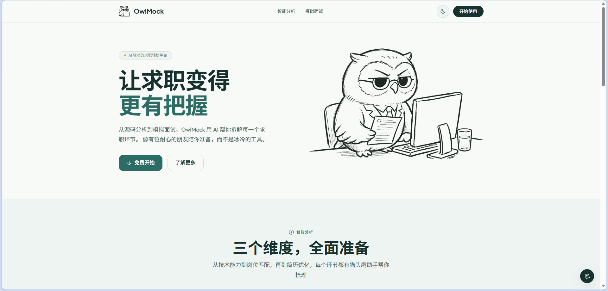
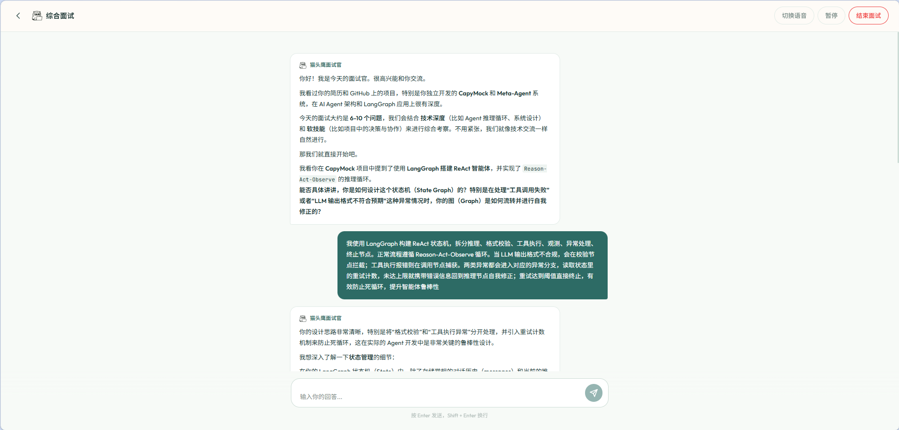
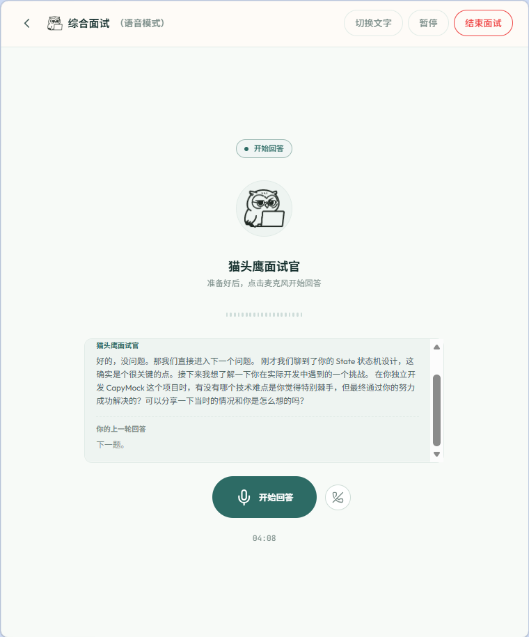
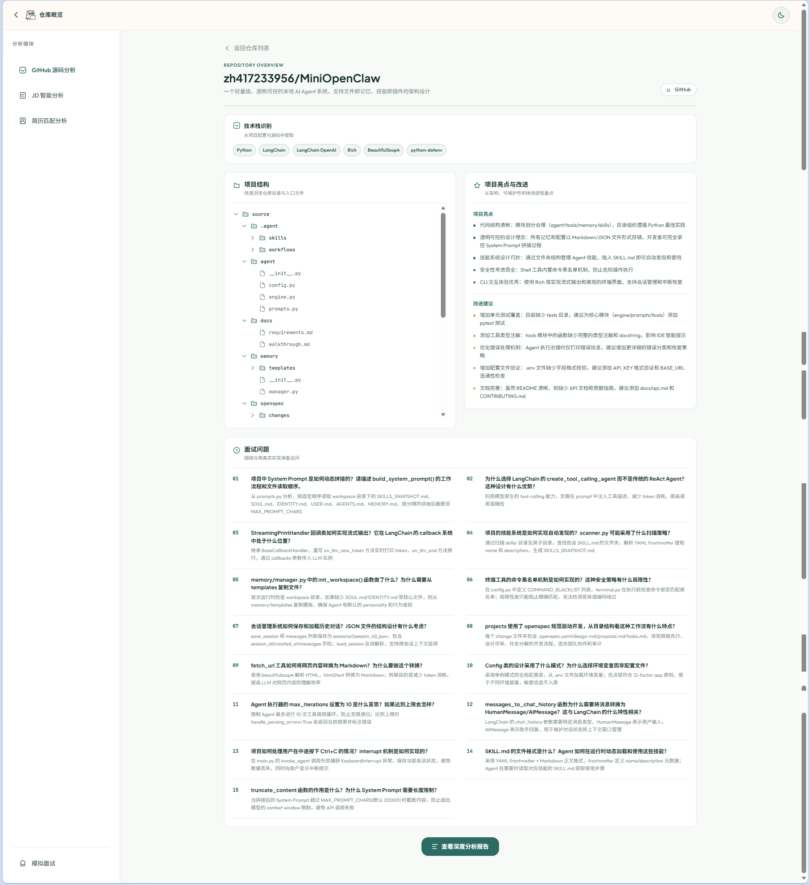
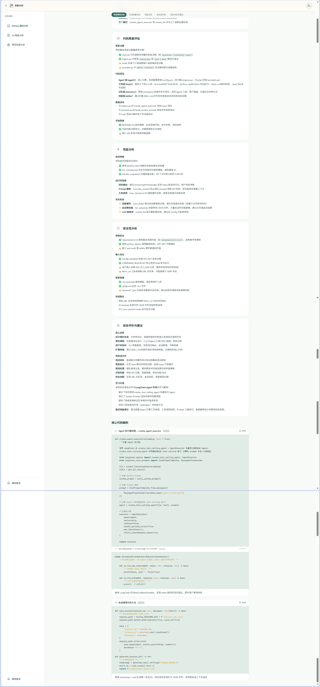
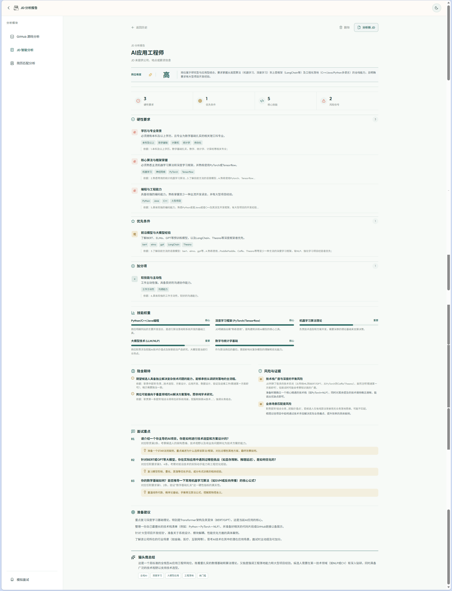
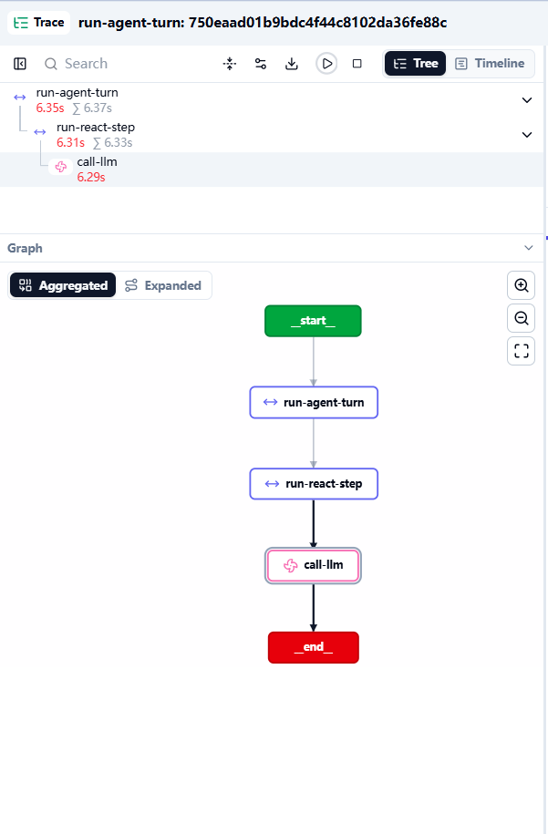

# OwlMock

<p align="center">
  <strong>把岗位理解、项目复盘、简历匹配和模拟面试连成一条 AI 求职准备链路。</strong>
</p>



OwlMock 是一个面向求职准备的 AI 分析与模拟面试平台。它可以分析岗位 JD 和 GitHub 仓库，将一份简历与多个目标岗位进行匹配，并基于这些上下文开展文字或语音模拟面试。

产品形象是一只拟人化猫头鹰面试官。界面使用黑白线稿、青绿色主色和少量金色提示，支持浅色与深色模式。

## 功能

- **JD 智能分析**：支持粘贴文字或上传 PNG/JPEG 岗位截图，输出硬性要求、优先条件、技能权重、隐含期待、风险点和面试重点。
- **简历匹配分析**：管理 PDF、PNG、JPG 简历，选择一个或多个已分析岗位，异步生成匹配报告和岗位横向对比。
- **GitHub 源码分析**：接收标准 GitHub 仓库地址，通过浅克隆、归档或 API snapshot 获取代码，生成 Repository Index、项目概览、深度报告和项目追问题。
- **模拟面试**：覆盖技术、行为和综合面试；文字模式使用 SSE 流式回复，语音模式采用“开始回答 -> 回答完毕 -> 下一题”的手动分轮交互。
- **历史记录管理**：GitHub、JD、简历匹配和模拟面试均支持历史查看与删除；JD 和匹配报告支持批量删除。
- **任务恢复与缓存**：长任务在后台运行，页面切换后可以恢复进度；仓库缓存和索引减少重复下载与无意义工具调用。
- **Langfuse 可观测性**：记录 Agent、工具和模型调用的耗时、输入输出、错误与 token 使用情况。
- **按场景路由模型**：优先使用 DashScope Qwen，遇到可重试错误时按 profile 切换到智谱 GLM。

## 界面预览

### 文字与语音面试



<p align="center">
  
</p>

### GitHub 仓库分析



<details>
<summary>查看 GitHub 深度分析长图</summary>



</details>

### JD 分析

<details>
<summary>查看 JD 分析报告长图</summary>



</details>

### Langfuse Trace

<p align="center">
  
</p>

## 技术栈

| 层级 | 技术 |
| --- | --- |
| 前端 | Vue 3、Vite 6、Vue Router、Tailwind CSS、Lucide Icons |
| 后端 | Python 3.13、FastAPI、SQLAlchemy 2.0、aiosqlite |
| Agent | ReAct Agent Loop、Realtime Voice Agent、YAML Agent Profile、Tool System |
| 模型 | DashScope Qwen、Zhipu GLM、OpenAI-compatible 适配层 |
| 实时语音 | DashScope Qwen-Omni Realtime、WebSocket、PCM16 |
| 数据 | SQLite、JSONL 会话事件、Markdown 记忆、Repository Cache |
| 可观测性 | Langfuse、OpenTelemetry |

## 工作流程

### GitHub 分析

```text
GitHub URL
  -> Repository Loader (shallow clone / archive / snapshot)
  -> repo_cache workspace
  -> Repository Index + Repository Context
  -> Repo Analyzer Agent
  -> Overview / Deep Report / Interview Questions
  -> SQLite + Task progress / SSE
```

同一仓库会复用缓存和 `repo_index.json`。仓库工作区位于后端源码目录之外，避免 `uvicorn --reload` 因下载代码而重启。

### JD 与简历匹配

```text
Text or JD Image -> asynchronous JD analysis -> structured JD report
Resume PDF/Image + one or more analyzed JDs
  -> multimodal resume parsing
  -> independent match tasks
  -> score comparison + detailed reports
```

### 模拟面试

```text
Text:  message -> ReAct Agent -> SSE events
Voice: interviewer question -> start answer -> audio chunks
       -> finish answer / commit -> realtime model -> next question
```

语音模式不依赖自动静音判断来结束回答，用户点击“回答完毕”后才会进入下一题。

## 模型路由

默认值由 `backend/config/agents/*.yaml` 管理，也可以通过环境变量按 profile 覆盖。

| 场景 | 主模型 | 备用模型 |
| --- | --- | --- |
| 简历分析 | `dashscope/qwen3.5-omni-plus` | `zhipu/glm-4.6v-flash` |
| 简历与岗位匹配 | `dashscope/qwen3.5-omni-plus` | `zhipu/glm-4.6v-flash` |
| JD 分析 | `dashscope/qwen3.5-omni-plus-2026-03-15` | `zhipu/glm-4.6v-flash` |
| GitHub 分析 | `dashscope/qwen3.5-omni-plus-2026-03-15` | `zhipu/glm-4.6v-flash` |
| 模拟面试 / 总结 | `dashscope/qwen3.5-omni-plus-2026-03-15` | `zhipu/glm-4.6v-flash` |
| 实时语音 | `dashscope_realtime/qwen3.5-omni-flash-realtime` | 无 |

只有限流、超时和服务端 5xx 等可重试错误会触发 fallback。参数或模型名称错误会直接返回，避免重复消耗额度。

## 快速开始

### 环境要求

- Python 3.13+
- [uv](https://docs.astral.sh/uv/)
- Node.js 18+
- DashScope API Key（仅在启用 AI 分析时需要）
- Zhipu API Key（可选 fallback）

### 启动后端

```bash
cd backend
uv sync
cp .env.example .env
uv run uvicorn api.app:app --host 0.0.0.0 --port 8000 --reload
```

Windows PowerShell 可使用 `Copy-Item .env.example .env`。在 `backend/.env` 中配置 AI provider（登录和浏览产品不依赖 provider）：

```dotenv
DASHSCOPE_API_KEY=your-dashscope-key
ZHIPU_API_KEY=your-zhipu-key
```

后端默认运行在 `http://localhost:8000`。

也可以使用后端目录中的 Docker 配置：

```bash
cd backend
docker compose up --build backend
```

### 启动前端

```bash
cd frontend
npm install
npm run dev
```

前端默认运行在 `http://localhost:3000`，开发服务器会将 `/api` 和 `/ws` 代理到后端。

### 启用 Langfuse

```dotenv
TRACER=langfuse
LANGFUSE_PUBLIC_KEY=pk-lf-...
LANGFUSE_SECRET_KEY=sk-lf-...
LANGFUSE_BASE_URL=https://us.cloud.langfuse.com
LANGFUSE_TRACING_ENVIRONMENT=development
```

## 项目结构

```text
OwlMock/
├── frontend/
│   ├── public/                 # favicon 等静态资源
│   └── src/
│       ├── pages/              # 首页、分析报告、任务状态、模拟面试
│       ├── components/         # common、github、jd、resume、interview
│       ├── composables/        # 异步任务、语音和分析状态逻辑
│       ├── layouts/            # 分析模块布局
│       ├── router/             # Vue Router
│       └── api/                # REST / SSE / WebSocket 客户端
├── backend/
│   ├── agent/                  # ReAct / Realtime Agent 与模型路由
│   ├── api/                    # REST、SSE、WebSocket 路由
│   ├── config/agents/          # 场景化 Agent Profile
│   ├── data/                   # Prompt 与 Repo Analyzer Skill
│   ├── service/                # Task、Index、JD/Resume 报告服务
│   ├── storage/                # SQLite、JSONL、Markdown Memory
│   ├── tool/                   # 内建工具与 ToolContext
│   ├── trace/                  # Langfuse 可观测性
│   └── tests/                  # pytest 测试
├── repo_cache/                 # 运行时仓库缓存，不提交
├── analysis_cache/             # 运行时上传缓存，不提交
└── README.md
```

## 数据与安全

- 不要提交 `backend/.env`，只提交无密钥的 `.env.example`。
- 简历、JD 截图、仓库缓存、SQLite、会话日志和本地测试输出均已加入 `.gitignore`。
- OwlMock 支持公开邮箱账户。密码使用标准库 `scrypt` 加盐哈希，登录状态使用签名 HttpOnly Cookie。
- 访客可以直接浏览产品预览；创建项目、上传简历、分析和面试等实际数据操作需要注册或登录。
- 所有项目、简历、分析、任务和面试会话按用户 ID 隔离。旧版单用户数据可通过同时设置 `OWLMOCK_BOOTSTRAP_EMAIL` 与 `OWLMOCK_ADMIN_PASSWORD` 迁移到 `default` 账户。
- 当前 beta 不接入付费邮箱服务，因此暂不提供邮箱验证和密码找回；可通过 `OWLMOCK_ALLOW_REGISTRATION=false` 关闭新注册。
- 公开服务启用了进程内登录/注册限流；SQLite 模式必须使用持久化卷和单副本。
- 源码中的 `CAPYMOCK_` 环境变量前缀和 `capy_note` 字段是为旧数据保留的兼容标识，不是当前产品名称。

## Deployment and operations

### First setup with Docker Compose

The production image serves the built Vue application and the FastAPI API from the
same origin. Docker Compose is defined in `backend/docker-compose.yml` and builds
the root `Dockerfile`.

```bash
cd backend
cp .env.example .env
# Set OWLMOCK_SESSION_SECRET in .env first.
docker compose up --build -d
docker compose logs -f app
```

Set these values before exposing the service:

```dotenv
# Required in production. Generate once, keep it stable, and do not share it.
OWLMOCK_SESSION_SECRET=replace-with-a-random-32-byte-secret
OWLMOCK_ALLOW_REGISTRATION=true
OWLMOCK_COOKIE_SECURE=true
TRACER=noop
```

Generate a session secret with `openssl rand -hex 32`.
`OWLMOCK_SESSION_SECRET` signs the login cookie;
changing it signs every active user out. The application can generate and persist a
secret under the data directory when it is empty, but an explicitly managed secret
is recommended for production and disaster recovery. Use
`OWLMOCK_COOKIE_SECURE=false` only for plain HTTP local development.

The Compose volume `owlmock-data` is the persistent `/data` directory. It contains
the SQLite database, uploaded files, session data, and backups. Do not delete or
replace that volume during an upgrade.

### Railway

Create a Railway service from this repository. Railway reads the root
`railway.toml` and builds the root `Dockerfile`; no separate frontend service is
required. Attach a persistent volume mounted at `/data`, keep the configured
single replica, then configure these service variables in Railway:

```dotenv
OWLMOCK_DATA_DIR=/data
OWLMOCK_SESSION_SECRET=replace-with-a-random-32-byte-secret
OWLMOCK_ALLOW_REGISTRATION=true
OWLMOCK_COOKIE_SECURE=true
OWLMOCK_AUTH_RATE_LIMIT=8
OWLMOCK_AUTH_RATE_WINDOW_SECONDS=300
TRACER=noop
# Set provider keys only for features you intend to use.
DASHSCOPE_API_KEY=
ZHIPU_API_KEY=
```

Railway provides `PORT`; leave it unset unless you are running outside Railway.
After the first deploy, open `/api/health/live` to confirm the service is healthy,
then open the Railway domain. Visitors can browse the public product preview;
each person creates their own account before using private workflows.

### Upgrades

Back up first. For Compose deployments, update the checkout and rebuild the image:

```bash
cd backend
docker compose exec app python -m management backup
docker compose build --pull
docker compose up -d
docker compose logs -f app
```

For Railway, make a backup, deploy the updated commit, and keep the `/data` volume
attached. The application runs its database initialization and supported migrations
on startup. If a version documents an additional manual migration, run it before
accepting production traffic.

### Backup and restore

The management command creates a consistent SQLite snapshot and packages managed
data in a ZIP archive. Its successful output is JSON such as:

```json
{"status":"ok","archive":"/data/backups/owlmock-20260805T000000Z.zip"}
```

Create a backup in the running Compose service:

```bash
cd backend
docker compose exec app python -m management backup
```

For a host-managed installation, provide the data directory and an output path:

```bash
cd backend
uv run python -m management backup --data-dir /srv/owlmock/data --output /srv/owlmock/backups/owlmock.zip
```

Restore only while the application is stopped. The command validates the ZIP,
checks checksums and the SQLite schema, and returns JSON with `restored_files` and
`schema_revision` on success.

```bash
cd backend
docker compose stop app
docker compose run --rm app python -m management restore /data/backups/owlmock-20260805T000000Z.zip
docker compose up -d app
```

For a host-managed installation, stop its service first and use:

```bash
uv run python -m management restore /srv/owlmock/backups/owlmock.zip --data-dir /srv/owlmock/data
```

### Reverse proxies and troubleshooting

Terminate TLS at the reverse proxy and proxy the whole application to port 8000.
The frontend, `/api`, and `/ws` share one origin, so do not split them into
different public services. A minimal Caddy configuration is:

```caddy
owlmock.example.com {
    reverse_proxy 127.0.0.1:8000
}
```

The image enables proxy headers, so standard `X-Forwarded-For` and
`X-Forwarded-Proto` headers are honored. Keep `OWLMOCK_COOKIE_SECURE=true` behind
HTTPS. When troubleshooting, start with `docker compose logs -f app` and
`curl http://127.0.0.1:8000/api/health/live`. An unhealthy readiness check usually
means `OWLMOCK_SESSION_SECRET` or the writable `/data` volume is missing; a login
that stops working after deployment usually means the session secret changed. Missing data after a redeploy means
the service no longer has its original `/data` volume attached.

## License

[MIT](LICENSE)
